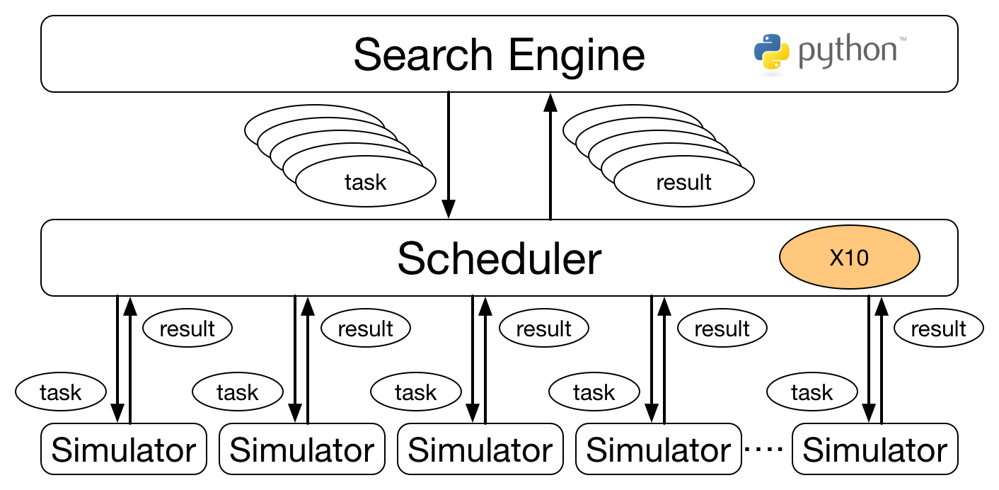

# CARAVAN

A framework for large scale parameter-space exploration.
Using CARAVAN, you can easily run your simulation programs with a bunch of different parameters in parallel using HPCs.
Possible applications include

- embarrassingly parallel problem
- parameter tuning
- data assimilation
- optimization of parameters
- sensitivity analysis

## How it works

The following figure illustrates the whole architecture of CARAVAN.

<p align="center"></p>

CARAVAN consists of three parts: **search engine**, **scheduler**, and **simulator**.

**Simulator** is an executable program which you want to execute in parallel. Since it is executed as an external process, it must be prepared as an executable program beforehand, i.e., it must be compiled in advance. You can implement a simulator in any language.

**Scheduler** is a part which is responsible for parallelization. It receives the commands to execute simulators from **search engine**, distributes them to available nodes, and executes the **simulator** in parallel. This part is implemented in X10, and users are not supposed to edit it by themselves. If a system administrator provides a binary executable, users do not even have to compile it.

**Search engine** is a part which determines the policy on how parameter-space is explored. More specifically, it generates a series of commands to be executed in parallel, send them to **scheduler**. It also receives the results from the scheduler when these tasks are done. Based on the received results, **search engine** can generate other sets of tasks repeatedly as many as you want.

Prepare a simulator and a search engine to conduct parameter-space exploration. Once these are implemented, it can scale up to tens of thousands of processes.

### Expected scale of tasks

CARAVAN is designed for the case where the duration of each task (a single run of your simulator) typically ranges from several seconds to several hours.
CARAVAN does not perform quite well for tasks which finish in less than a few seconds. One of the reasons for this limitation comes from the design decision that a simulator is executed as an external process. For each task, CARAVAN makes a temporary directory, creates a process, and reads a file generated by the simulator, which amounts to some overheads.
If you would like to run such fine-grained tasks, consider using other frameworks such as Map-Reduce or Spark.
Instead, the scheduler of CARAVAN is designed such that it realizes an ideal load balancing even when the durations vary significantly. The tolerance for the variation in time is essential for parameter-space exploration since elapsed times usually depends notably on the parameter values.

## Installation

### Prerequisites

- x10 2.5.4 or later
    - x10 is a parallel programming language. See [official page](http://x10-lang.org/) for installation.
    - tested against native x10 2.5.4 with MPI backend
    - managed x10 is not available since it uses C++ code as well
- Python 2.7 or later

### Building the scheduler

```
./caravan_scheduler/build.sh
```

By default, "Socket" is selected as X10RT. If you are going to build an MPI-backed program, set environment variable "IS\_MPI" to "1" when building it.

```
env IS_MPI=1 ./caravan_scheduler/build.sh
```

The executables are built in the `build/` directory.

### Running a sample project

To run the sample project, make a temporary directory and run the shell script in the sample directory.

```
mkdir -p temp
cd temp
{CARAVAN_DIR}/samples/benchmark/run_bench.sh
```

or, for MPI-backed program,

```
mkdir -p temp
cd temp
env IS_MPI=1 {CARAVAN_DIR}/samples/benchmark/run_bench.sh
```

The environment variable `X10_NPLACES` specifies the number of places (i.e. processes), whose default value is 16. See the shell script.
The number of places must be larger than or equal to 3 because CARAVAN uses at least 3 process for task scheduling.

After running the command, you'll find `tasks.bin` file, which contains information of task scheduling.
You can visualize it using [caravan_viz](https://github.com/crest-cassia/caravan_viz).
(For the file format of the dump file, see [dump_format.md](dump_format.md).)

## Samples

Several samples are in `samples/` directory, which include

- [file_input](samples/file_input): An example of embarrassingly parallel problem. Executes commands listed in a file in parallel.
- [optimization](samples/optimization): A simple optimization problem using a differential evolution algorithm
- [multi-objective optimization](samples/nsga2): A multi-objective optimization problem using a python library

See the README in each directory for the usage.

## Preparation of your simulator and search engine

### Preparation of a simulator

A simulator must satisfy the following requirements.

1. accept parameters as command line arguments
1. generate outputs in the current directory
1. (optional) write results to `_results.txt` file

Prepare a simulator such that it accepts parameters as command line arguments like the following.
This is because the scheduler receives the command lines from a search engine and just executes them.
You may use a shell script (or other kinds of scripts) as your simulator which converts command line arguments in a proper way to conform to the original simulation program.

```
./your_simulator.out <param1> <param2> <param3> ....
```

A simulator is supposed to generate its output files or directories in the current directory.
The scheduler makes a directory for each task and executes the simulator after it changed the current directory to this directory.
The path of the directory is made as `sprintf("w%04d/w%07d", task_id/1000, task_id)`.
If the ID of a task is "12345" for instance, the temporary directory for this task is "w0012/w0012345".

If your simulator writes a file `_results.txt`, it is parsed by the scheduler and is sent back to the search engine.
This is useful when your search engine determines the next parameters according to the simulation results.
For instance, if would like to optimize the simulation results, write a value which you want to minimize (or maximize) to `_results.txt` file.
You can write only floating point values which are separated by white spaces or line breaks like the followings.

```
1.23 2.34 3.45
```

or

```
1.23
2.34
3.45
```

### Preparation of a search engine

In most cases, you can reuse the sample program.
Copy the sample directory you want to reuse. Edit a python program and re-define `map_point_to_cmd` function, which receives parameters and random number seed and returns a command-line string.

## License

See [LICENSE](LICENSE).

